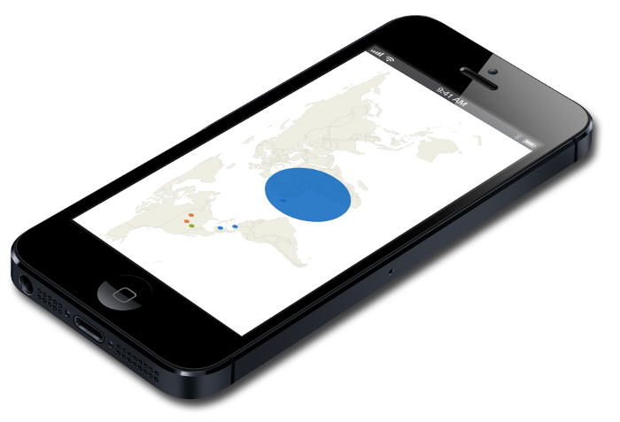
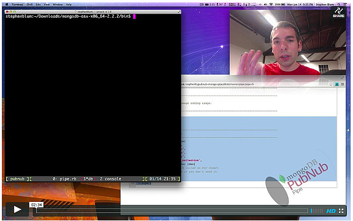

# Streaming Geo Coordinates from MongoDB to your iPhone App with PubNub WebSocket SDK



Not long ago we partnered with a high-standards online
engineering broker (an online listing service
where you can post engineering projects).
The partnership involved joint PR and blogging, however
a new opportunity/idea was presented.
This particular idea stemmed from a commission listed on the broker's website
which listed requirements for building an integrated Real-time Map Service.
We took the opportunity and built a **Ruby GEM** with a sprinkle
of documentation and HTML5.

## Quick Start Guide

For those of you who need a **quick mini-guide** to getting your MongoDB
installed and running with data sync streaming directly to your mobile app, you 
can follow this guide: 
[MongoDB Pipe GitHub Repository](https://github.com/stephenlb/pubnub-mongo-pipe).
It will show you how to download/install MongoDB and the `MongoPipe` GEM.

### Real-time Data Stream of Geo Coordinates 
Lat/Long from MongoDB replicated to your iPhone App

The commission at the online workplace was posted as a $3,025 bounty.
Rather than taking the commission for ourselves,
which involves building and delivering the solution in a *private exchange*,
we instead reviewed the specifications and requirements and we developed an
open source implementation that you can
download and run for your live app today!
MIT License, so you can use this however you desire.
We even created a GEM for you and made it easy to get started:

```
gem install monogopipe
```

Downloading the GEM is the first step in the process
and next we'll walk you through more details.
Actually now may be the time for you to **watch the short video**,
so feel free to jump into that now 
if you want a very brief demonstration and usage covering these points:

 1. Installing the Ruby gem and 
 2. Executing the commands to setup MongoDB and
 3. Running the Pipe Daemon.
 4. Launching the Map Viewer.
 5. Finally inserting lat/long coords into MongoDB.
 6. Result is live-animated points on a map displayed on the iPhone.

>The video will show usage of the MongoPubNubPipe gem.
Source code is available via GitHub if you want to see everything - 
[MongoDB Pipe GitHub Repository](https://github.com/stephenlb/pubnub-mongo-pipe)

This becomes the `new` interface that is available with `mongopipe` gem:

```ruby
MongoPubNubPipe::Connect.new(...)
```

Usage of `MongoPubNubPipe` is available lower in this document.

### Play Video - MongoDB Geo Coordinates

[

](https://vimeo.com/60716860)

The video demonstrates an implementation of the
connection between **MongoDB** and a **mobile device** (an iPhone in this case).
This application code and gem library will provide you a way to easily add a live
always-on map connection which allows you to send lat/long signals
directly to the device displaying the map with the specific
Lat/Long DB written into MongoDB.
**This will cause the device to draw an animated dot onto the 
screen of the device in real-time.**

The dot that animates is triggered by simply writing to your MongoDB collection directly
either through the mongo console or through your RoR/Ruby Server Code.
For example here is a MongoDB Console Command that will cause a DB write,
creating a Document, which then
triggers the sync with the consumer iPhone device that is rendering the map
in real-time.

```javascript
db.collection_name.insert({ latlon : [ 1.5, 2.0 ] })
```

Once you've written a Lat/Long coordinate into MongoDB collection,
the process begins instantly synchronizing with any connected iPhone.
We where able to include several feature requests
and here follows the requirements:

 - When a new Lat/Lon document is **inserted** into MongoDB,
   stream the Lat/Lon data to a mobile device is push data.
 - Use a **Ruby** or Node.JS Service to stream the data out of MongoDB
   as it is written in real-time.

Simple enough, yes, though it requires moving pieces.
We simplified the process and built two modules:
one in `Ruby` and one in `HTML5`.
We'll walk through the methods for getting you started and
how to hook into the stream on your iPhone App.
You can fast-track the tutorial and go strait to the 
GitHub Repository or `gem install mongopipe` package for ruby.

### GitHub Repository

[MongoDB Pipe GitHub Repository](https://github.com/stephenlb/pubnub-mongo-pipe)

```
 ## Ruby
gem install monogopipe
```

## How it Works

MongoPipe is a new tool powered by [PubNub](http://www.pubnub.com) that
**streams your MongoDB Documents** from your MongoDB Collection directly
to your iPhone App in less than 0.25 seconds (real-time)
using the PubNub Real-time Network.
Your iPhone app opens an always-on TCP Socket Connection to PubNub while a dispatch
process runs on your MongoDB server via Tailable Cursors to catch inserted documents.
The data is streamed and brokered via PubNub Network directly to your
iPhone App in real-time.

## MongoDB Tailable Cursors

The ruby GEM `mongopipe` utilizes the tailable cursor interface provided by MongoDB Core.
Document Data is then piped directly through the PubNub Network which uses
a direct broadcast synchronization socket with the mobile app.

Next we'll show you what the process is to get the `mongopipe` running on your Ruby Server.

### Make sure MongoDB is running

```
mongod
```

Next open a text editor and copy/paste the following mongopipe example.

```ruby
require 'rubygems'
require 'mongopipe'

 ## ------------------------------------------------------------------------
 ## Pipe MongoDB for Inserts
 ## ------------------------------------------------------------------------
MongoPubNubPipe::Connect.new(
    :puts_usage    => true,
    :publish_key   => 'demo',
    :subscribe_key => 'demo',
    :db            => 'test',
    :collection    => 'cap_collection',
    :callback      => lambda{ |doc|
        ## Optional Callback Called on Doc Insert
        ## Remove :callback if you don't need it.
        puts(doc)
    }
).pipe()
```

Save this to a file `pipe.rb` for example then **execute it**.

```
ruby pipe.rb
```

This will connect directly to MongoDB and print usage guide on next steps.
The video covers only a demonstration of this process.
Here is a sample output of what may be provided via the `puts(doc)` output:

```
 ------------------------------------------------------
 Step 1:
 -------
 Open Your Browser to Show PubNub Pipe Console
 ------------------------------------------------------
 
 > open http://www.pubnub.com/console?channel=test.cap_collection
 
 ------------------------------------------------------
 Step 2:
 -------
 Open Demo Map on Your Phone
 ------------------------------------------------------
 
 > open http://goo.gl/HAqAv#test.cap_collection
 
 ------------------------------------------------------
 Step 3:
 -------
 Insert Test Data
 ------------------------------------------------------
 
 > ./mongo
 
 > use test
 > db.cap_collection.insert({ latlon : [ 1.5, 2.0 ] })
```

## Remaining Details

This blog entry was intended to give you a quick skim over the details
on how the `mongopipe` ruby gem works and what is involved in coordinating
the embeddable mobile HTML5 animated map.

If you have any more questions please tweet [@PubNub](http://twitter.com/PubNub) directly.

You may be curious about the connectivity mechanism between your
iPhone App and your MongoDB Sever.
Checkout the **PubNub WebSocket Reference** below to see
the transport mechanism utilized.

Thank you for reading!

## PubNub WebSocket Reference

The MongoDB Pipe uses the PubNub Network WebSocket interface which provides an always-on
socket connection to your iPhone app.
The PubNub Network WebSocket acts as a broadcast receiver and syncs directly
to your mobile device in real-time
from your MongoDB server via MongoPipe.

Following is an example of how the Map app implements the socket:

```javascript
// Create Socket Connection
var socket = new WebSocket('wss://pubsub.pubnub.com/PUBLISH_KEY/SUBSCRIBE_KEY/CHANNEL');

// Set Message Receiver Function
socket.onmessage = receiver;

// Receiver Function Prints Data Result
function receiver(evt) {
    console.log(evt.data);
}
```


